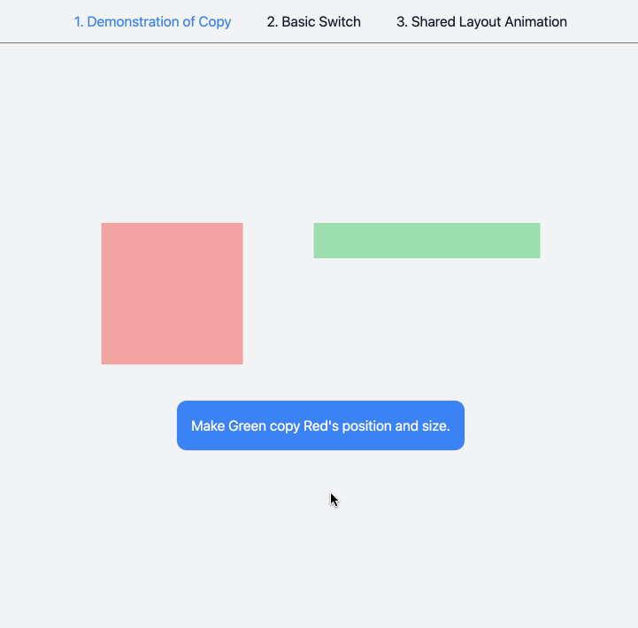

# solid layout motion

This is a testbed, not a library. Some proof-of-concepts I achieved:

- [x] Tween position (hardest)
- [x] Tween scale (hardest)
- [ ] Tween transform origin
- [ ] Tween opacity (should be easy)
- [ ] Tween border radius (should be easy)
- [ ] Tween rotation (idk)

As of the moment, there are no docs on how to use [Motion.dev](https://motion.dev/) for Layout animations (just like Framer Motion has) for SolidJS, let alone VanillaJS.

I spent some time reverse-engineering how Framer Motion does shared layout animations via a `layoutId`, and
the results were super promising, I just had to share.

This uses the `motion` library under the hood (to honor the Framer Motion inspiration), but you can probably
use any tweening library. This just demonstrates how to achieve that tweened View Transition illusion using
just JavaScript.

I made a [video](https://github.com/Blankeos/solid-layout-motion/issues/1) of how my thought-process went into solving this problem.
